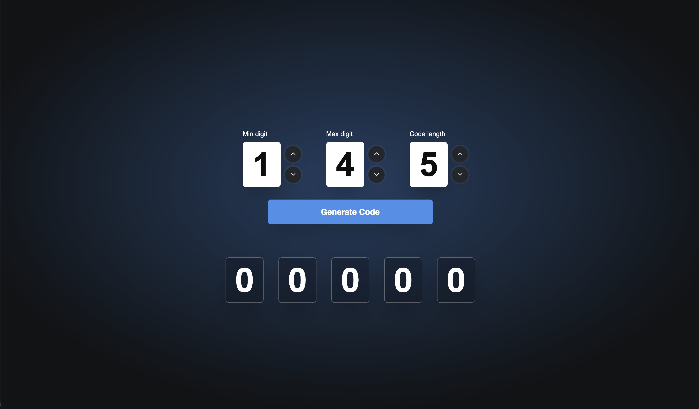

# Locksmith App


Locksmith App is a React + TypeScript application for generating lock-style numeric codes based on configurable constraints.

Users can set:

- Minimum digit
- Maximum digit
- Code length

Then generate a code where each digit is randomly selected within the selected range.

## Screenshot



## Features

- Random numeric code generation with configurable range and length
- Duplicate-code prevention for recent generations
- Animated code digit display
- Keyboard-friendly numeric input controls:
- Type a digit directly
- Use `ArrowUp` / `ArrowDown` to increment or decrement values

## Tech Stack

- React 19
- TypeScript
- Vite
- Motion (`motion/react`) for digit animation
- Lucide icons
- CSS Variables for theming and styling

## Getting Started

### Prerequisites

- Node.js 20+
- npm

### Install

```bash
npm install
```

### Run locally

```bash
npm run dev
```

### Build for production

```bash
npm run build
```

### Preview production build

```bash
npm run preview
```

## Available Scripts

- `npm run dev` - Start Vite dev server
- `npm run build` - Type-check and build the app
- `npm run preview` - Preview the built app
- `npm run lint` - Run ESLint
- `npm run typecheck` - Run TypeScript checks without emitting files
- `npm run format` - Format TypeScript files with Prettier

## Project Structure

- `src/CodeGenerator.tsx`: Main generator UI and interaction flow
- `src/hooks/useCodeGenerator.ts`: Code generation logic and history handling
- `src/components/lock/`: Lock input controls and actions
- `src/components/code/`: Code output display components
- `src/styles.css`: App styles
